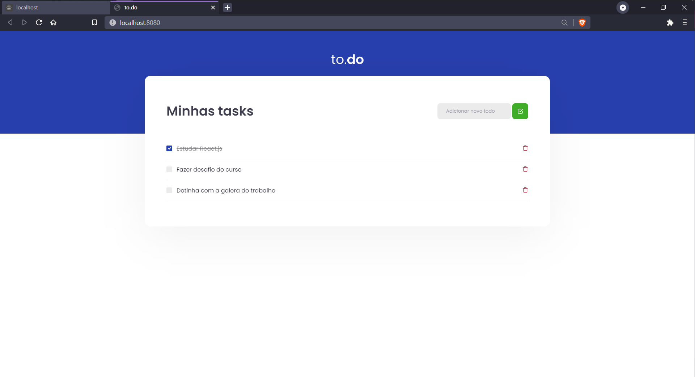

 

# to.do

## Sobre o desafio

Essa será uma aplicação onde o seu principal objetivo é uma pequena aplicação de atividades a fazer (todo), para treinar um pouco mais sobre manipulação do estado no React.

- Adicionar uma nova tarefa
- Remover uma tarefa
- Marcar e desmarcar uma tarefa como concluída

## Tasks list do desafio.

- [x] Crie uma nova task com um id random, não permita criar caso o título seja vazio.
- [x] Altere entre `true` ou `false` o campo `isComplete` de uma task com dado ID
- [x] Remova uma task da listagem pelo ID

## Links

- [Desafio](https://www.notion.so/Desafio-01-Conceitos-do-React-51e4099a6e2f4d4bae94f9fe75bb769d)
- [Template](https://github.com/rocketseat-education/ignite-template-reactjs-conceitos-do-react)
